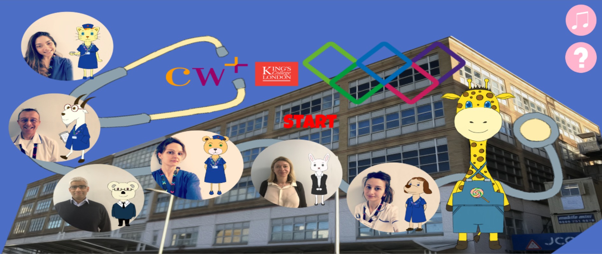
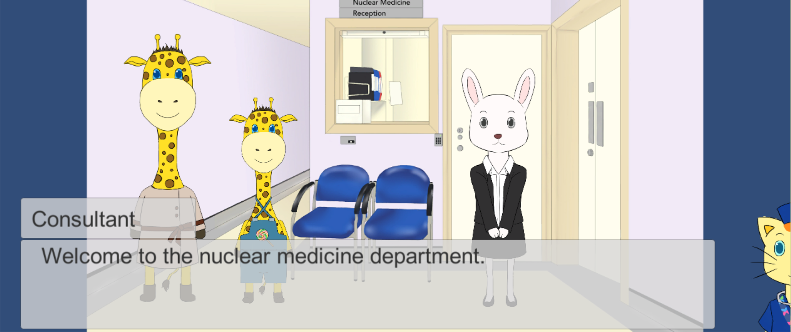
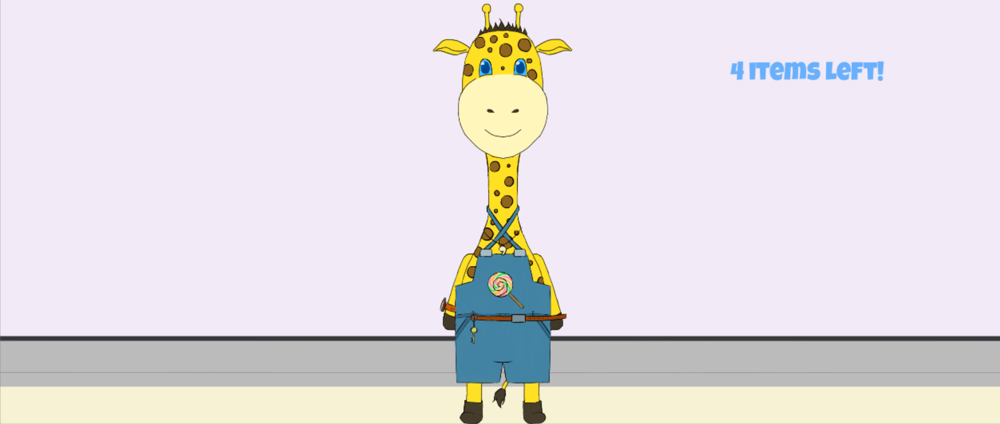
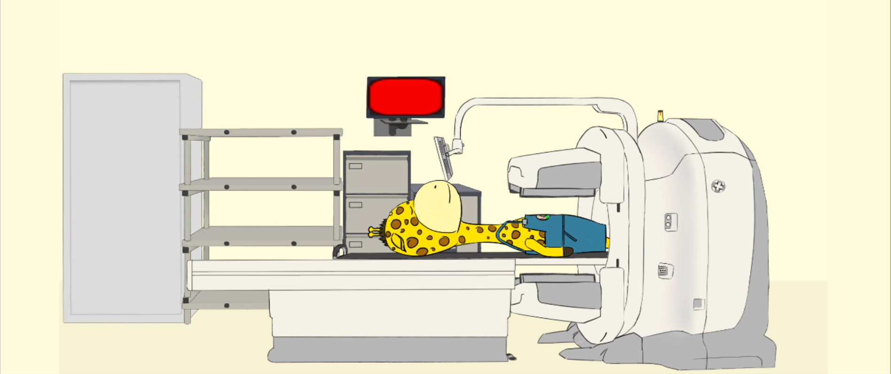
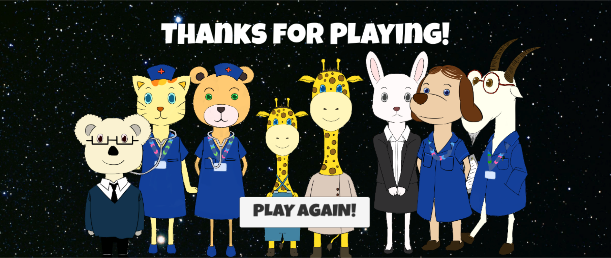

# Software Engineering Group Project - Major Project

## Team 2B||!2B

Team 2B||!2B has chosen to a game application for pediatric patients of Chelsea & Westminster Hospital, Nuclear and Medicine
Department. 

The game revolves around the SPECT/CT Scanning procedure for patients, targeted to 2-10 years old patients.

The project is part fulfilment of the SEG module for Year 2 Computer Science, King's College London.

### Team Members

1.  **1438028**  Bin Mohamad Pauzi, Ahmad Zaki
2.  **1626077**  Jones, Joshua
3.  **1609577**  Przewlocki, Mateusz
4.  **1611268**  Wang, Shuyue
5.  **1622703**  Kucharski, Adrian
6.  **1537780**  Nedelcu, Emanuela
7.  **1622105**  Song, Yurun
8.  **1649054**  Peng, Weiyi

## Gameplay

Non-final version [video](https://www.youtube.com/watch?v=2rUMoYJFI3U)

### Final version

Home screen.

The player initially selects their age group. For the older age group, some of the games are more challenging.

The game has a linear timeline, walking the patient through the entire hospital visit. All rooms presented in the game are reproduced from Chelsea and Westminster Hospital's rooms that the patient will visit.

The game presents 7 mini-games. Here the patient has to identify and remove all metal items on the character.

Each procedure has explanations both as text, images and animations.

## License

This project is licensed under the MIT License - see the [LICENSE.md](LICENSE.md) file for details.

## Building & running the game

This game was built with [Unity](https://unity3d.com/) and Unity is thus necessary to be installed in order to run the game from the source code in this repository. 

See this [Unity tutorial](https://unity3d.com/learn/tutorials/projects/roll-ball-tutorial/building-game) for instructions on building the game.

## Running the tests

### Edit Mode Tests and Play Mode tests
- Edit mode test scripts are found in "Assets > Scripts > Test > Editor"
- Play mode test scripts are found in "Assets > Scripts > Test"

To execute both tests, launch Unity > Window > Test Runner. Toggle between
the Edit Mode and Play Mode tabs to run the tests.
